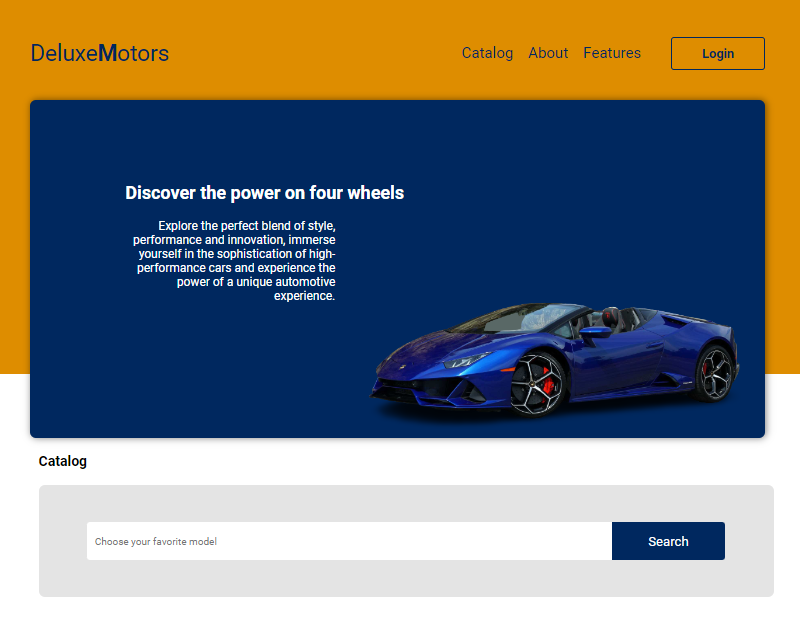
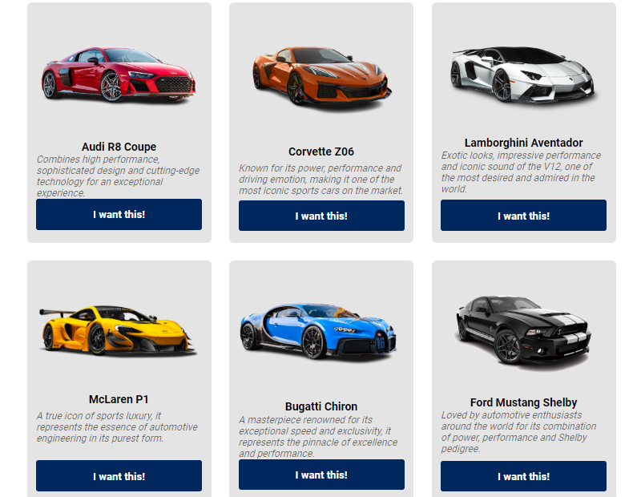
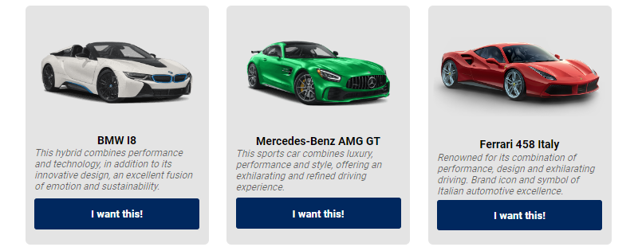
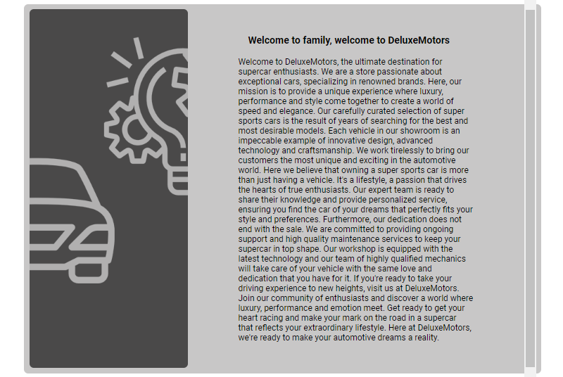
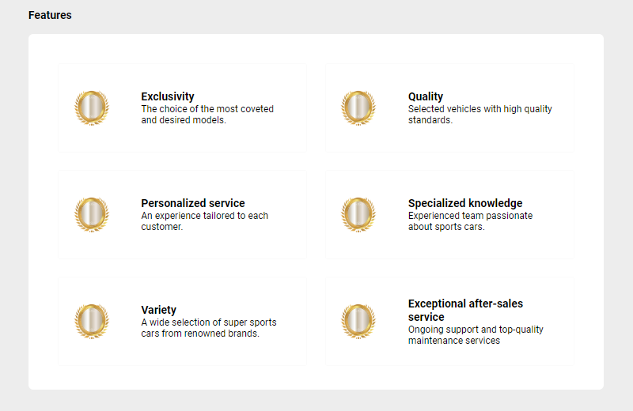
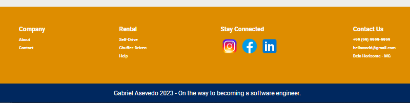

 
  <h1>💎DeluxeMotors💎</h1>

 

## About the project📜
- Project created during studies of the front-end world, with the objective of improving myself beyond the back-end to be able to have a solid base during my career.
- It is a purely visual project without the possibility of interaction with JavaScript, a website of luxury car sales.
  
## Technologies used 💻⚙️ 
- Visual Studio Code 
- Html5 
- Css3
  
## Project view

 
  
  
  
  
  
  

